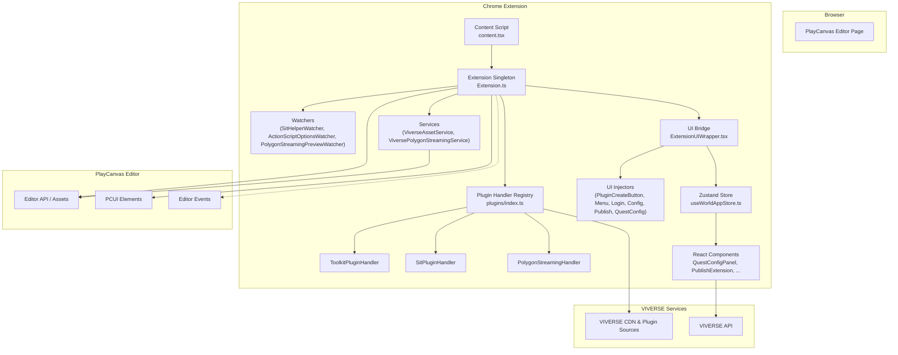

# VIVERSE PlayCanvas Toolkit

The **VIVERSE PlayCanvas Toolkit** is a browser extension designed to integrate **VIVERSE** features into the PlayCanvas Editor. It empowers creators to rapidly build interactive content and provides a one-click solution to publish directly to the **VIVERSE** platform.

---

## Installation

### 📌 Install Node.js


Ensure you have **Node.js** installed before proceeding.

---

### 📌 Install pnpm


Install `pnpm` globally:

```sh
npm install -g pnpm
```

### 📌 Install Dependencies

Run the following command to install required packages:

> **🌐 Please connect to HTC VPN if you are outside the HTC intranet**

```bash
pnpm install
```

---

## Development

To build and run **PlayCanvas Editor Extension** in your local development environment, follow these steps:

### 1️⃣ Build the project

```bash
# Build PlayCanvas editor extension with specific bundle script
pnpm build:extension
```

### 2️⃣ Install the extension in your browser

1. Open **Google Chrome**.
2. Navigate to **Extensions** (`chrome://extensions/`).
3. Enable **Developer Mode** (top-right corner).
4. Click **Load unpacked** and select the `dist` folder in `apps/editor-extension/dist`.
5. The extension **"VIVERSE PlayCanvas Toolkit"** should now appear in the list.
6. Reload the PlayCanvas Editor page—the toolkit will be injected automatically.

### 3️⃣ Update the extension in your browser

1. **Rebuild the project** (performed automatically if `pnpm build` is running).
2. In Chrome's **Extensions** page, click **Update**.

---

## How `VIVERSE PlayCanvas Toolkit` Works

The VIVERSE PlayCanvas Toolkit is a browser extension that injects a React application into the PlayCanvas Editor. It uses the editor's official API (`@playcanvas/editor-api`) and its UI library (`@playcanvas/pcui`) to seamlessly integrate VIVERSE-specific features, such as a Quest System and a one-click publishing service.

### **Architecture Overview**

The extension operates through a content script (`src/content.tsx`) that acts as the entry point when a user loads the PlayCanvas editor. This script initializes a core singleton class (`src/Extension.ts`) which manages all interactions with the editor, and then renders multiple React components into the editor's user interface.

State is managed centrally by a [Zustand](https://github.com/pmndrs/zustand) store (`src/hooks/useWorldAppStore.ts`), which serves as a single source of truth for the application's data, including the Quest configuration and user authentication status.



### **Core Modules & Data Flow**

1.  **Initialization (`content.tsx`)**:
    - When the PlayCanvas editor DOM is ready, this script is injected.
    - It waits for the editor's `assets:load` event to ensure the project is ready.
    - It initializes the `Extension.ts` singleton, which sets up all necessary event listeners on the PlayCanvas editor API.
    - It renders the root React component (`ExtensionUIWrapper`) which orchestrates all UI injection components.

2.  **Extension Core (`Extension.ts`)**:
    - This singleton class is the brain of the toolkit. It does not use React.
    - **Event Handling**: Listens to editor events like entity selection, asset addition/removal, etc.
    - **Plugin Management**: On initialization, it fetches the latest VIVERSE plugin scripts (e.g., Trigger, Condition, Action) from a VIVERSE CDN.
    - **State Management**: Manages plugin metadata and entity selection state, and notifies React components through callbacks registered via `registerUIUpdateCallback()`.
    - **Script Injection**: When a user adds a VIVERSE component from the menu, this class delegates to plugin handlers (via `plugins/` module) which programmatically create the corresponding script asset in the PlayCanvas project and attach it to the selected entity.

3.  **Plugin Handlers (`plugins/`)**:
    - Uses a **Strategy Pattern** to handle different plugin types (Toolkit plugins, Sit plugin, Polygon Streaming, etc.).
    - **`BasePluginHandler`**: Abstract base class providing common functionality for script upload, attachment, and progress UI.
    - **`ToolkitPluginHandler`**: Handles standard VIVERSE PlayCanvas Toolkit plugins (Trigger, Action, Condition, etc.).
    - **`SitPluginHandler`**: Specialized handler for the Sit plugin with custom entity setup.
    - **`PolygonStreamingHandler`**: Handles Polygon Streaming plugin which requires downloading and extracting a ZIP file.
    - Each handler implements the `PluginHandler` interface and is registered in `plugins/index.ts`.

4.  **Managers & Watchers (`watchers/`)**:
    - **`SitHelperWatcher`**: Manages visual helper entities for the Sit plugin, creating and updating cylinder render entities that visualize seat radius.
    - **`ActionScriptOptionsWatcher`**: Manages dynamic options for action scripts by parsing action schema and updating script enums when quest names change.
    - **`PolygonStreamingPreviewWatcher`**: Manages preview entities for Polygon Streaming models in the editor. When a `streamableModel` script is attached to an entity, it automatically creates a preview entity with the same script to visualize the streaming model in the editor viewport.

5.  **Services (`services/`)**:
    - **`ViverseAssetService`**: Manages creation and updating of PlayCanvas script assets, handles script upload, parsing, and attachment to entities.
    - **`ViversePolygonStreamingService`**: Manages Polygon Streaming script loading and initialization. Loads `polygon-streaming.js` from a ZIP file, initializes the `streamController` entity (required for streaming functionality), and ensures the script is available before entities try to use it.

6.  **State Management (`useWorldAppStore.ts`)**:
    - A central Zustand store holds all shared state.
    - **`questConfig`**: The main data structure for the Quest System, loaded from a `viverse-metadata.json` file in the project.
    - **`temporaryQuestConfig`**: A "draft" copy of the `questConfig`. All UI edits are made to this temporary state, allowing for a clean save/cancel workflow without affecting the original data until the user confirms.
    - **`isEditingQuestConfig`**: A boolean flag that toggles the UI between read-only and edit modes.
    - The store contains all actions for mutating the state (e.g., `addQuest`, `updateTaskField`).

7.  **UI Injection (`ui-injector/`)**:
    - The toolkit uses React components to inject UI into specific locations in the PlayCanvas Editor.
    - **`ExtensionUIWrapper.tsx`**: Bridges the `Extension.ts` singleton with React, managing state updates and callbacks.
    - **`ExtensionUI.tsx`**: Orchestrates all injector components, passing plugin metadata and entity selection state.
    - **Injector Components**: Each injector is a focused React component that handles DOM creation, React root management, and cleanup:
      - **`PluginCreateButtonInjector`** & **`PluginMenuInjector`**: "ADD VIVERSE COMPONENT" button and context menu in the entity inspector.
      - **`LoginButtonInjector`** & **`ConfigButtonInjector`**: Login and configuration buttons in the editor toolbar.
      - **`PublishUIInjector`**: Publishing UI in the publish panel.
      - **`QuestConfigInjector`**: Quest configuration panel in the inspector (triggered by `attributes:inspect[questConfig]` event).

8.  **React UI (`components/`)**:
    - **`QuestConfigPanel.tsx`**: Main UI for creating and editing quests and tasks.
    - **`PublishExtension.tsx`**: UI for the publishing flow.
    - **`PostEffectConfigPanel.tsx`**: Main UI for configuring camera Post Effects and saving them into `viverse-metadata.json`.
    - **`PostEffectEditor.tsx` / `PostEffectParameterForm.tsx`**: Editor and dynamic parameter form for each Post Effect, driven by schemas defined in `types/post-effect.ts`.
    - All components read from and update the Zustand store, automatically re-rendering when state changes.

### **User Flows**

#### **Adding a VIVERSE Component (e.g., Trigger)**

1.  The user selects an entity in the PlayCanvas editor.
2.  In the inspector panel, the user clicks the "ADD VIVERSE COMPONENT" button created by the toolkit.
3.  A dynamic menu appears, listing available components (Trigger, Action, etc.).
4.  The user selects "Trigger".
5.  The `Extension.ts` singleton delegates to the appropriate plugin handler:
    a. The handler creates a `viverse-trigger.mjs` script asset in the project (using the code fetched from the CDN).
    b. Adds a "script" component to the selected entity if it doesn't exist.
    c. Attaches the `viverse-trigger` script to the entity's script component.
6.  The user can now configure the trigger's properties in the inspector.

#### **Adding Polygon Streaming Component**

1.  The user selects an entity in the PlayCanvas editor.
2.  In the inspector panel, the user clicks the "ADD VIVERSE COMPONENT" button and selects "Polygon Streaming".
3.  The `PolygonStreamingHandler`:
    a. Downloads the Polygon Streaming ZIP file from the CDN.
    b. Extracts `polygon-streaming.js` from the ZIP.
    c. Uploads the script to the PlayCanvas project's `.viverse` folder.
    d. Creates a `ViverseStreamController` entity (if it doesn't exist) with the `streamController` script for scene-level streaming configuration.
    e. Attaches the `streamableModel` script to the selected entity.
4.  The `ViversePolygonStreamingService` ensures the Polygon Streaming script is loaded and the `streamController` entity is initialized before any entities use it.
5.  The `PolygonStreamingPreviewWatcher` automatically creates a preview entity with the same `streamableModel` script, allowing the user to see the streaming model in the editor viewport in real-time.
6.  The user can configure the `streamableModel` attributes (path, useAlpha, environment, etc.) and see the preview update automatically.

#### **Editing a Quest**

1.  The user opens the "VIVERSE Configuration" panel and clicks "Edit" in the "Quest Configuration" section.
2.  The `useWorldAppStore` copies the current `questConfig` to `temporaryQuestConfig` and sets `isEditingQuestConfig` to `true`.
3.  The `QuestConfigPanel` UI re-renders in edit mode, now bound to the `temporaryQuestConfig` data.
4.  The user adds or modifies quests and tasks. All changes are saved only to the `temporaryQuestConfig` in the store.
5.  The "Save" button becomes enabled because the temporary state now differs from the original.
6.  The user clicks "Save".
7.  The `handleSave` function in `QuestConfigPanel`:
    a. Updates the `viverse-metadata.json` file in the PlayCanvas project with the new configuration from `temporaryQuestConfig`.
    b. Calls the `saveTemporaryQuestConfig` action in the store, which copies the temporary data into the main `questConfig` and resets the edit state.
8.  The UI returns to read-only mode, displaying the newly saved data.

#### **Configuring Post Effects**

1.  In the PlayCanvas editor inspector, select the **VIVERSE Post Effect Configuration** item (triggered via the `attributes:inspect[postEffectConfig]` event).
2.  If no VIVERSE App exists yet, a prompt appears asking you to create one before configuring Post Effects.
3.  Once an App is available, the **Post Effect Configuration** panel is shown in the inspector.
4.  Click **Edit** to switch the panel into edit mode.
5.  Click **Add Post Effect** to append a new Post Effect to the list.
6.  For each Post Effect:
    a. Use the **Type** dropdown to choose the effect (for example `BloomEffect`, `VignetteEffect`, `SSAOEffect`, etc.).  
    b. Adjust its parameters (intensity, radius, focus, hue/saturation, etc.) using the auto-generated form powered by `PostEffectSchemas` from `types/post-effect.ts`.
7.  Click **Save** to write the updated `postEffectConfig` into `viverse-metadata.json` via `ViverseAssetService`.
8.  Click **Cancel** to discard all unsaved changes. If there are unsaved edits, a confirmation dialog appears before discarding them.

---

### **Project Structure**

```
./src
├── assets                    # Static assets and template JS scripts
├── components                # React components
│   ├── common                # Reusable components (Pickers, InfoBox, etc.)
│   ├── QuestConfigPanel.tsx  # Main UI for the Quest System editor
│   ├── QuestEditor.tsx       # Component for editing a single quest
│   ├── PublishExtension.tsx  # UI for the publishing flow
│   ├── PostEffectConfigPanel.tsx # UI for configuring camera Post Effects
│   ├── PostEffectEditor.tsx      # Editor for a single Post Effect item
│   └── ...
├── constants                 # Constant values (enums, strings)
├── hooks                     # Custom React hooks, including Zustand stores
│   └── useWorldAppStore.ts   # The central state management store (Quest & Post Effect configs, etc.)
├── watchers                  # Singleton watchers for specialized functionality
│   ├── SitHelperWatcher.ts           # Manages Sit plugin visual helpers
│   ├── ActionScriptOptionsWatcher.ts # Manages action script dynamic options
│   ├── PolygonStreamingPreviewWatcher.ts # Manages Polygon Streaming preview entities
│   ├── MediaControlsWatcher.ts       # Manages media controls preview
│   ├── VideoTexturePreviewWatcher.ts # Manages video texture preview
│   └── AudioZoneHelperWatcher.ts     # Manages audio zone visual helpers
├── plugins                   # Plugin handler system (Strategy Pattern)
│   ├── handlers/            # Plugin handler implementations
│   │   ├── base-plugin-handler.ts      # Base class for all handlers
│   │   ├── toolkit-plugin-handler.ts # Toolkit plugins handler
│   │   └── polygon-streaming-handler.ts # Polygon Streaming handler
│   ├── plugin-handler.ts    # PluginHandler interface
│   └── index.ts             # Handler registry
├── services                  # Business logic modules
│   ├── publish.ts            # Logic for the publishing API
│   ├── viverse-asset-service.ts # Manages PlayCanvas script assets
│   ├── polygon-streaming-service.ts # Manages Polygon Streaming script loading
│   ├── viverse-toolkit-service.ts # Core toolkit services
│   └── ...
├── sso                       # Single Sign-On authentication assets
├── types                     # TypeScript type definitions
│   ├── quest.ts              # Data structure for the Quest System
│   ├── plugin.ts             # Plugin metadata and behavior types
│   ├── post-effect.ts        # Post Effect configuration types and schemas
│   └── script.ts             # Script-related types
├── ui-injector               # UI injection components
│   ├── ExtensionUI.tsx       # Orchestrator for all UI injectors
│   ├── ExtensionUIWrapper.tsx # Bridge between Extension.ts and React
│   ├── PluginCreateButtonInjector.tsx # VIVERSE button and tooltip
│   ├── PluginMenuInjector.tsx # Plugin selection menu
│   ├── LoginButtonInjector.tsx # Login button injection
│   ├── ConfigButtonInjector.tsx # Config button injection
│   ├── PublishUIInjector.tsx # Publish UI injection
│   ├── QuestConfigInjector.tsx # Quest config panel injection
│   └── PostEffectConfigInjector.tsx # Post Effect config panel injection
├── utils                     # Utility functions
│   ├── ScriptAttachmentHelper.ts  # Helper for script attachment and progress UI
│   ├── plugin-source-loader.ts    # Loads plugin sources from CDN/ZIP
│   └── common/                    # Common utilities
├── content.tsx               # Entry point: Injected into the web page
├── Extension.ts              # Core singleton class for editor interaction
├── global.ts                 # Global variables (e.g., pcEditor instance)
└── init.ts                   # Early initialization script
```
