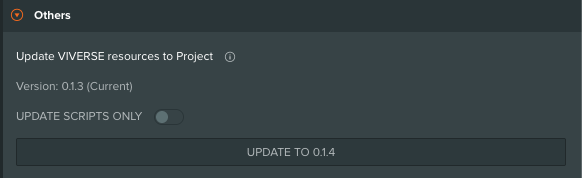

# Contributing to VIVERSE PlayCanvas Toolkit

Welcome! We're excited that you want to contribute to VIVERSE PlayCanvas Toolkit. This guide will help you get started, whether you're fixing a typo or adding a major feature.

## Table of Contents

- [Development Setup](#development-setup)
- [Testing Your Changes](#testing-your-changes)
- [Submitting Pull Requests](#submitting-pull-requests)
- [Coding Standards](#coding-standards)
- [Commit Messages](#commit-messages)
- [Pre-commit Hooks](#pre-commit-hooks)
- [Documentation](#documentation)

## Development Setup

1. **Fork and clone** the repository:

   ```bash
   git clone https://github.com/viverseofficial/viverse-playcanvas-toolkit.git
   cd viverse-playcanvas-toolkit
   ```

2. **Install dependencies**:

   ```bash
   pnpm install
   ```

3. **Test and Run checks** to ensure everything works. refer the [Testing](#testing) for details.

   ```bash
   pnpm type-check
   pnpm lint
   ```

4. **Preview** app at the configured port with hot reload.

   ```bash
   pnpm dev
   ```

5. **Build** choose to build all packages and extension. refer the [Testing with PlayCanvas Editor](#testing-with-playcanvas-editor) for details

### Working with Assets

See [ASSETS_GUIDE.md](./ASSETS_GUIDE.md) for details on asset organization and usage.

## Testing

### Running Checks

```sh
# Type checking
pnpm type-check

# Linting
pnpm lint

# Format code
pnpm prettier
```

### Testing in Preview App

Always test your changes in the preview app:

```sh
pnpm dev
```

### Testing with PlayCanvas Editor

If your changes affect PlayCanvas editor integration:

1. **Build the extension:**

   ```bash
   pnpm build
   ```

2. **Install the extension:**
   - Load the built extension from `apps/editor-extension/dist` into Chrome
   - See [Extension Setup](https://docs.viverse.com/playcanvas-sdk/playcanvas-extension-setup) for detailed instructions

3. **Deploy to your test project:**

   Choose one of the following methods:

   **Option A: Update All Files (Recommended for major changes)**
   1. Build and install the extension (see [Using the PlayCanvas Editor Extension](#using-the-playcanvas-editor-extension))
   2. In your PlayCanvas project, open the VIVERSE settings panel
   3. Under **Others** section, click **Update to YOUR_VERSION** or **Reset Toolkit Assets**. The button text depends on your current version:
      - **Update to YOUR_VERSION** - Appears when a newer version is available (YOUR_VERSION shows the actual version number)
      - **Reset Toolkit Assets** - Appears when you're already on the latest version

   

   **Option B: Update Individual Files (For single file changes)**
   1. Locate your built file in `apps/editor-extension/public/toolkit`
   2. Drag and drop it into your PlayCanvas project's `.viverse` folder to replace the existing file

### Test Guidelines

- **Test new features** - Verify functionality works as expected
- **Test edge cases** - Consider boundary conditions
- **Check for regressions** - Ensure existing features still work
- **Update examples** - If applicable, update or add examples

Before submitting a pull request, make sure:

1. All type checks pass: `pnpm type-check`
2. All linting passes: `pnpm lint`
3. Your changes work in the preview app: `pnpm dev`
4. Test with PlayCanvas editor

## Submitting Pull Requests

1. **Create a focused PR** - One feature or fix per pull request
2. **Write a clear description** - Explain what changes and why
3. **Reference issues** - Link to related issues with "Fixes #123" or "Closes #123"
4. **Test thoroughly** - Ensure all checks pass (`pnpm type-check`, `pnpm lint`)
5. **Follow code standards** - See coding standards below
6. **Update documentation** - Update relevant docs and examples
7. **Be patient** - Reviews take time, especially for complex changes

### Git Workflow

- Create feature branches from `main` or `develop`: `git checkout -b feature-name`
- Use clear commit messages following Conventional Commits (see [Commit Messages](#commit-messages))
- Keep commits focused and atomic when possible
- Rebase/squash if requested during review

## Coding Standards

We use **ESLint** and **Prettier** to maintain consistent code style across the project. All code must pass these checks before being merged.

See [CONVENTIONS.md](./CONVENTIONS.md) for detailed guidelines on:

- Naming conventions (files, classes, variables, events)
- Code style and best practices
- Performance optimization patterns
- TypeScript usage guidelines

### General Principles

- **Keep it simple** - Prefer clear, modular code over clever solutions
- **Use American English spelling** - Examples: "Initialize" not "Initialise", "color" not "colour"
- **Follow TypeScript best practices** - Use modern TypeScript features appropriately
  - [TypeScript Handbook](https://www.typescriptlang.org/docs/handbook/intro.html)
  - [TypeScript Accessors](https://www.typescriptlang.org/docs/handbook/classes.html#accessors)
- **Follow PlayCanvas standards** - This toolkit builds on PlayCanvas Engine and should align with their conventions
  - [PlayCanvas Coding Standards](https://github.com/playcanvas/engine/tree/main?tab=contributing-ov-file#coding-standards)
  - [PlayCanvas API Reference](https://api.playcanvas.com/)

## Commit Messages

This project uses [commitlint](https://github.com/conventional-changelog/commitlint) to enforce commit message standards.

Please follow the [Conventional Commits](https://www.conventionalcommits.org/en/v1.0.0/) specification.

Format: `<type>(<scope>): <subject>`

Types:

- `feat`: A new feature
- `fix`: A bug fix
- `docs`: Documentation only changes
- `style`: Changes that do not affect the meaning of the code
- `refactor`: A code change that neither fixes a bug nor adds a feature
- `perf`: A code change that improves performance
- `test`: Adding missing tests or correcting existing tests
- `chore`: Changes to the build process or auxiliary tools

Examples:

- `feat(core): add billboard script`
- `fix(avatar): resolve rotation issue`
- `refactor(extension): improve script attribute handling`

## Pre-commit Hooks

This project uses `Husky` for pre-commit hooks. The following checks will run automatically before each commit:

- Linting (ESLint)
- Type checking
- Commit message validation (commitlint)

When your change affects user-facing guidance, run `pnpm review:nontechnical-ux` manually before opening a release or export.
When your change touches the Toolkit API knowledge files or their refresh scripts, also run `node scripts/refresh-toolkit-api-knowledge.mjs --check-drift` manually to catch stale generated Toolkit API knowledge files.

If your change affects user-facing preview guidance in skills or prompts, also review the wording manually before pushing:

1. confirm the instructions derive preview from the target project's own dev or preview command when one exists
2. confirm the wording does not point the agent at repo templates, temporary copied template folders, or stale previously used preview URLs
3. confirm the wording does not normalize guessed hosts or ports unless the target project or server output provides them

Make sure all checks pass before pushing your changes.

## Documentation

We use **JSDoc** for API documentation generation. Documentation is automatically generated and published when pull requests are merged.

### Documentation Requirements

When contributing code, ensure you provide:

**JSDoc Comments:**

- Add JSDoc comments for all public APIs (classes, interfaces, methods, properties)
- Include parameter descriptions, return types, and usage examples where helpful
- Follow the existing JSDoc patterns in the codebase

**Package Documentation:**

- Update package README files if your changes affect usage
- Add or update code examples to demonstrate new features
- Document any breaking changes or migration steps

**Convention Updates:**

- Update [CONVENTIONS.md](./CONVENTIONS.md) if you're introducing new coding patterns or standards

### Preview Documentation Locally

To preview generated documentation before submitting:

```bash
pnpm gen-docs
```
